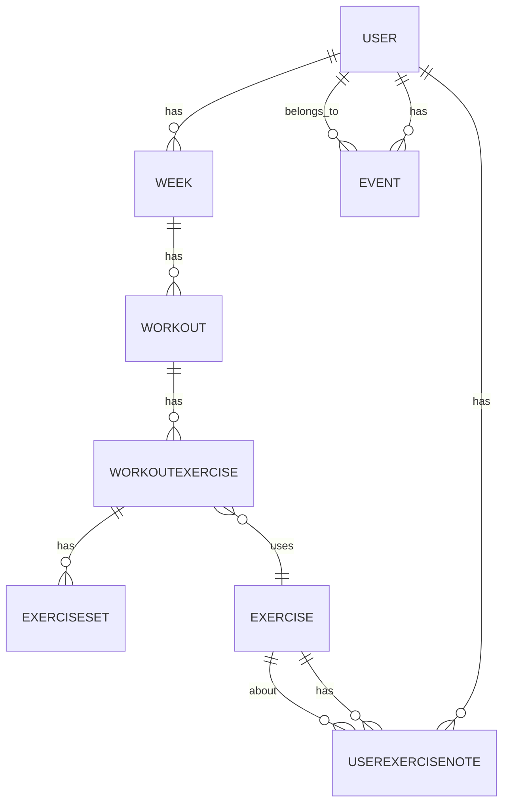

# Forti - WorkoutApp

A fitness tracking app where users manage weekly workouts, exercises, and sets.

---

## Features

- TODO

---

## Tech Stack

- **Node.js**
- **Prisma**
- **PostgreSQL**
- **Neon**
- **TypeScript**

---

## 🛠 Dev Notes

To reset the database (full data loss):

```bash
npx prisma db push --force-reset
prisma generate
```

---

## Database Schema - Mermaid ER Diagram (requires plugin)



Calendar powered by FullCalendar (https://fullcalendar.io)