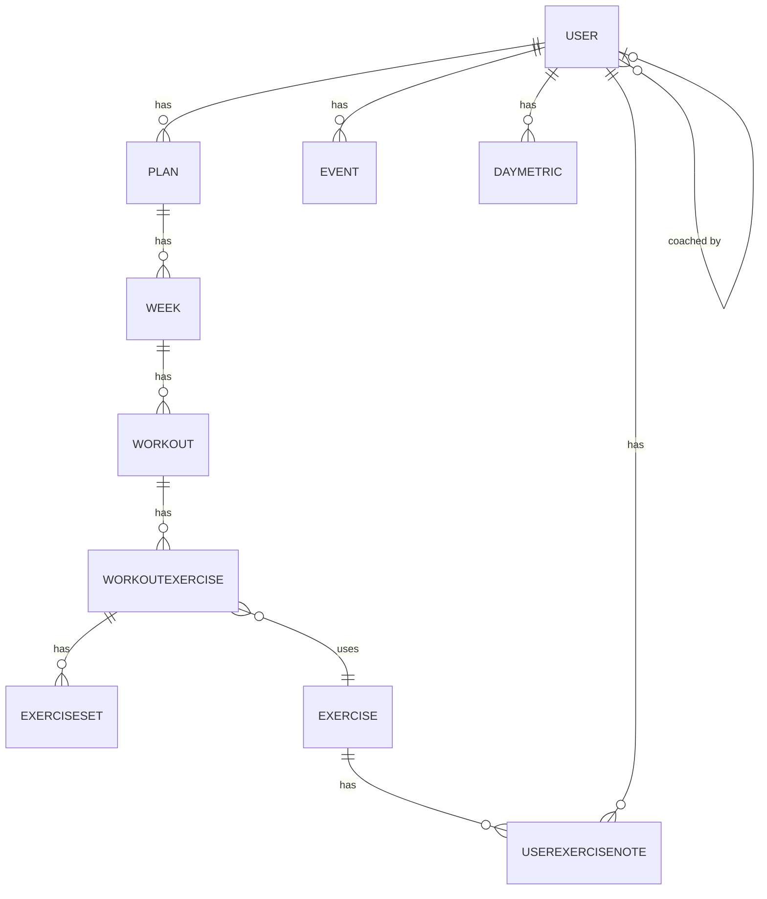

# Forti — Fitness Tracking App

A full-stack fitness tracking web application for planning workouts, logging daily health metrics, and tracking progress over time.

---

## Features

### Workout Planning & Execution
- **Structured training plans** — Build multi-week plans with weeks → workouts → exercises → sets
- **AI plan generation** — Generate personalised programs via guided questionnaire or freeform prompt (Claude API)
- **Plan templates** — Browse pre-built programs to start from
- **Workout import** — Import plans from CSV / Google Sheets
- **Active workout tracking** — Execute workouts with set-by-set logging (reps, weight, cardio metrics)
- **Built-in stopwatch** — Configurable timer during workout sessions
- **Exercise substitution** — Swap exercises mid-workout without losing session state
- **Add-on exercises** — Add exercises to a workout on the fly, beyond the original plan

### Progress & Analytics
- **E1RM tracking** — Estimated one-rep max auto-computed (Epley formula) per set, with history
- **Previous session comparison** — Last session's sets shown inline while logging current session
- **Previous cardio data** — Last cardio metrics shown for pace/distance reference
- **Exercise notes** — Persistent personal form cues per exercise, visible during logging

### Health Metrics & Calendar
- **Daily health metrics** — Log weight, steps, sleep, calories, and macros (protein, carbs, fat)
- **Historical metric charts** — ApexCharts visualisations of metric trends over time
- **Training blocks** — Schedule Bulk, Cut, Deload, Maintenance, Refeed, Prep, and custom phases on a calendar
- **Calendar events** — Create custom calendar events alongside training blocks

### Exercise Library
- **Global exercise database** — Browse all exercises, filterable by muscle group and equipment
- **Muscle highlighting** — Visual body diagram showing primary and secondary muscles
- **Custom exercises** — Add new exercises to the shared library

### Coach & Social
- **Coach-client model** — Coaches can view and manage client training plans

### Platform
- **Offline support** — Full offline capability with IndexedDB queuing and background sync on reconnect
- **Mobile-first** — Optimised for mobile web with touch interactions and dynamic viewport units
- **Dashboard customisation** — Toggle which cards and widgets are visible on the home screen

---

## Tech Stack

| Layer | Technology |
|---|---|
| Framework | Next.js 16 (App Router) + React 19 |
| Language | TypeScript (strict mode) |
| Database | PostgreSQL via Prisma ORM (Neon serverless in production) |
| Auth | NextAuth.js (Google OAuth + demo login) |
| UI | Material-UI (MUI) v7 + Emotion |
| Calendar | FullCalendar v6 |
| Charts | ApexCharts |
| Testing | Vitest (unit) + Playwright (E2E) |
| Deployment | Vercel |

---

## Dev Notes

```bash
# Install dependencies
npm install

# Start dev server
npm run dev           # http://localhost:3000

# Database
npm run db:reset      # Force-reset DB, regenerate Prisma client, seed data
npm run seed          # Seed database (2 demo users + full data)
npm run rebuild-prisma  # Push schema changes and regenerate Prisma client

# Quality checks (also run by pre-commit hook)
npm run check         # test + lint + build
npm run test          # Unit tests (Vitest)
npm run test:e2e      # E2E tests (Playwright)
npm run lint          # ESLint
```


### API contracts

- Error envelope and canonical auth error codes: `docs/api-error-contract.md`
- Demo identities and seeded scenarios: `docs/demo-logins.md`

### Updating schema
There is a github action to update the schema. First, update the `schema.prisma` file. 
Then, run the `Migrate Database` Github action - it generates the migration file and commits it. 
When the deployment is promoted to production, any migration files are applied to the production database.

### Deployment environment variables

The following environment variables are required for cron routes in deployed environments:

- `CRON_SECRET` (required): shared secret used by `/api/cron/check-in-reminders` and `/api/cron/learning-plan-steps`.
  - Requests must include `Authorization: Bearer <CRON_SECRET>`.
  - If `CRON_SECRET` is missing at runtime, cron routes return `500` and log a configuration error.

---

## Database Schema



Calendar powered by [FullCalendar](https://fullcalendar.io)
