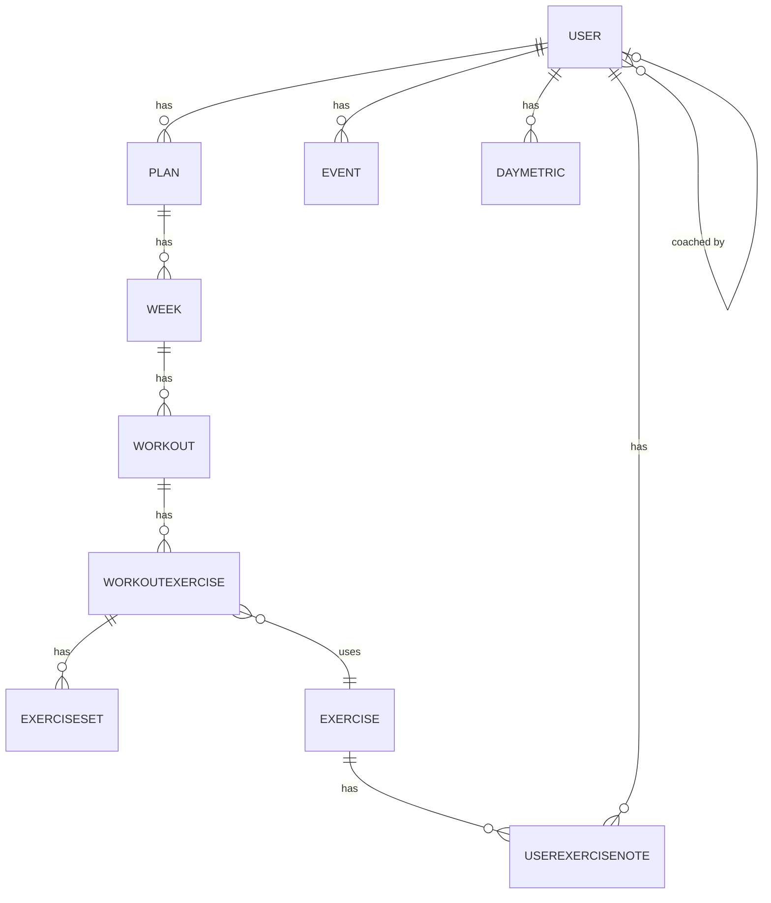

# Forti — Fitness Tracking App

A full-stack fitness tracking web application for planning workouts, logging daily health metrics, and tracking progress over time.

---

## Features

- **Workout planning** — Build weekly training plans with exercises and sets
- **Active workout tracking** — Execute workouts with set-by-set logging and a built-in stopwatch
- **Daily health metrics** — Log weight, calories, steps, and other daily metrics
- **Training blocks** — Manage Bulk, Cut, Deload, and custom training phases via a calendar
- **Exercise library** — Browse and manage a global exercise database
- **Historical trends** — View charts of metrics and training history over time
- **Coach-client model** — Coaches can view and manage client training plans
- **Offline support** — Works offline with background sync when reconnected
- **Workout import** — Import workouts from CSV / Google Sheets

---

## Tech Stack

| Layer | Technology |
|---|---|
| Framework | Next.js 16 (App Router) + React 19 |
| Language | TypeScript (strict mode) |
| Database | PostgreSQL via Prisma ORM (Neon serverless in production) |
| Auth | NextAuth.js (Google OAuth + demo login) |
| UI | Material-UI (MUI) v7 + Emotion |
| Calendar | FullCalendar v6 |
| Charts | ApexCharts |
| Testing | Vitest (unit) + Playwright (E2E) |
| Deployment | Vercel |

---

## Dev Notes

```bash
# Install dependencies
npm install

# Start dev server
npm run dev           # http://localhost:3000

# Database
npm run db:reset      # Force-reset DB, regenerate Prisma client, seed data
npm run seed          # Seed database (2 demo users + full data)
npm run rebuild-prisma  # Push schema changes and regenerate Prisma client

# Quality checks (also run by pre-commit hook)
npm run check         # test + lint + build
npm run test          # Unit tests (Vitest)
npm run test:e2e      # E2E tests (Playwright)
npm run lint          # ESLint
```

### Updating schema
There is a github action to update the schema. First, update the `schema.prisma` file. 
Then, run the `Migrate Database` Github action - it generates the migration file and commits it. 
When the deployment is promoted to production, any migration files are applied to the production database.

---

## Database Schema



Calendar powered by [FullCalendar](https://fullcalendar.io)
